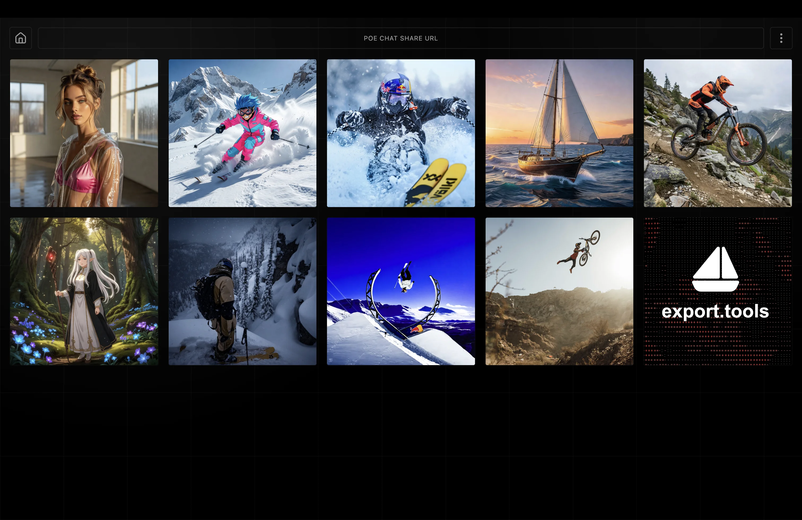

<!-- PROJECT LOGO -->
<br />
<div align="center">
  <a href="https://github.com/frontboat/poe-export-tools">
    
  </a>

<h3 align="center">export.tools</h3>

  <p align="center">
    Browse and download media from your Poe chat shares — a small Bun fullstack app.
    <br />
    <a href="fullstack/"><strong>Open the fullstack project »</strong></a>
    <br />
    <br />
    <a href="https://github.com/frontboat/poe-export-tools/issues/new?labels=bug">Report Bug</a>
    ·
    <a href="https://github.com/frontboat/poe-export-tools/issues/new?labels=enhancement">Request Feature</a>
    ·
    <a href="legacy/">Legacy Python Tools</a>
  </p>

  <p align="center">
    <a href="LICENSE"></a>
    <a href="https://bun.sh"></a>
    <a href="https://www.typescriptlang.org"></a>
  </p>
</div>

<!-- ABOUT THE PROJECT -->
## About The Project

<p align="center">
  
</p>

export.tools is a small Bun fullstack app that extracts attachment URLs from Poe share links. Paste a `https://poe.com/s/<id>` URL, browse the media in grid or chat view, and download everything as a zip — compression happens entirely in the browser.

### Features

- Paste a Poe share URL and see every attachment inline (images + videos)
- Toggle between a media grid and a chat-transcript view
- Upload a saved `next-data.json` to re-open a previous export offline
- Download all attachments plus `next-data.json` as a single zip
- Ships as a single standalone binary for easy deployment

<!-- GETTING STARTED -->
## Getting Started

### Installation

1. Clone the repo
   ```sh
   git clone https://github.com/frontboat/poe-export-tools.git
   ```
2. Enter the fullstack project
   ```sh
   cd poe-export-tools/fullstack
   ```
3. Install dependencies
   ```sh
   bun install --production
   ```

### Running locally

```sh
bun run server.ts
```

Open `http://localhost:3000`.

### Building

```sh
bun run build.ts
./fullstack
```

The build target defaults to `bun-linux-x64` (Railway). For a locally runnable binary on Apple Silicon, change `target` to `bun-darwin-arm64-modern` in `fullstack/build.ts` before building — don't commit that change.

<!-- DEPLOYMENT -->
## Deployment

Configured for Railway:

```
RAILPACK_BUILD_CMD="bun run build.ts"
RAILPACK_START_CMD="./fullstack"
RAILPACK_INSTALL_CMD="bun install --production"
RAILPACK_PACKAGES="bun@latest"
```

<!-- LEGACY -->
## Legacy Python Tools

The original upstream Selenium-based scripts — image downloader, chat text downloader, creator earnings exporter — live in [`legacy/`](legacy/) along with their own README. They are not under active development in this fork.

<!-- LICENSE -->
## License

Distributed under the MIT License. See `LICENSE` for more information.

<!-- DISCLAIMER -->
## Disclaimer

This tool is for personal use. Please respect Poe's terms of service and only export content you have permission to access.